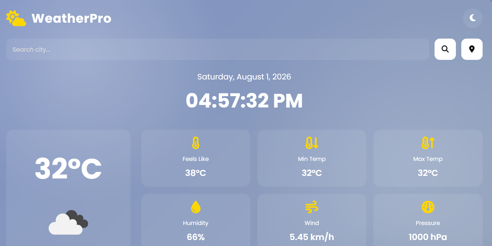
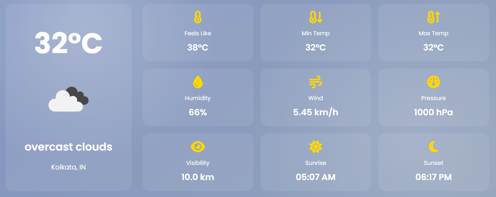
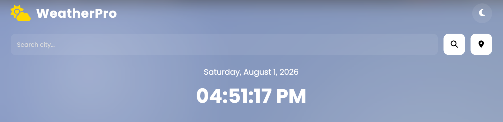

# 🌦️ WeatherPro

<p align="center">
  
</p>

<p align="center">
  <a href="https://debanshu-guchhait.github.io/WeatherPro/" target="_blank">
    
  </a>
  &nbsp;
  <a href="https://github.com/debanshu-guchhait/WeatherPro" target="_blank">
    
  </a>
</p>

<p align="center">
A modern and responsive weather application built with <strong>HTML, CSS, and JavaScript</strong>. WeatherPro provides real-time weather updates, hourly and 5-day forecasts, automatic location detection, dark/light mode, favorite cities, and recent search history using the OpenWeatherMap API.
</p>

---

# ✨ Features

- 🔍 Search weather by city
- 📍 Automatic location detection
- 🌡️ Real-time temperature
- 🤗 Feels Like temperature
- 📈 Maximum & Minimum temperature
- 💧 Humidity
- 🌬️ Wind Speed
- 📊 Atmospheric Pressure
- 👀 Visibility
- 🌅 Sunrise & Sunset
- ⏰ Live Digital Clock
- 📅 Current Date
- 📈 24-Hour Forecast
- 📅 5-Day Forecast
- 🌙 Dark / Light Theme
- ❤️ Favorite Cities
- ⭐ Recent Searches
- 💾 Local Storage Support
- 📱 Responsive Design
- ✨ Glassmorphism UI
- 🎨 Animated Weather Backgrounds

---

# 🛠️ Technologies Used

- HTML5
- CSS3
- JavaScript (ES6)
- OpenWeatherMap API
- Geolocation API
- Local Storage
- Font Awesome
- Google Fonts (Poppins)

---

# 📂 Project Structure

```text
WeatherPro/
│
├── index.html
├── style.css
├── script.js
│
├── js/
│   ├── weather.js
│   ├── forecast.js
│   ├── location.js
│   ├── theme.js
│   ├── storage.js
│   └── clock.js
│
├── image/
│   ├── preview.png
│   ├── menu.png
│   ├── 24 hours.png
│   ├── 5 day forcast.png
│   ├── favourit.png
│   └── search.png
│
├── README.md
└── LICENSE
```

---

# 📸 Screenshots

## 🏠 Home



---

## ⏰ 24-Hour Forecast


---

## 📅 5-Day Forecast


---

## ❤️ Favorite Cities


---

## 🔍 Search Weather



---

# ⚙️ Installation

### Clone the Repository

```bash
git clone https://github.com/debanshu-guchhait/WeatherPro.git
```

### Open the Project

```bash
cd WeatherPro
```

### Run the Project

Install the **Live Server** extension in VS Code.

Right-click **index.html**

Select

```
Open with Live Server
```

---

# 🔑 OpenWeather API Setup

1. Visit https://openweathermap.org/
2. Create a free account.
3. Generate an API Key.
4. Open:

```text
js/weather.js
```

Replace

```javascript
const API_KEY = "YOUR_API_KEY";
```

with

```javascript
const API_KEY = "YOUR_API_KEY_HERE";
```

Save the file and run the project.

---

# 🌍 Browser Support

- ✅ Google Chrome
- ✅ Microsoft Edge
- ✅ Brave
- ✅ Firefox
- ✅ Opera

---

# 🚀 Future Improvements

- Air Quality Index (AQI)
- UV Index
- Weather Alerts
- Multiple Languages
- Weather Maps
- PWA Support
- Offline Mode
- °C / °F Toggle
- Weather Animations

---

# 🤝 Contributing

Contributions are welcome!

1. Fork this repository.
2. Create a feature branch.

```bash
git checkout -b feature-name
```

3. Commit your changes.

```bash
git commit -m "Added new feature"
```

4. Push your branch.

```bash
git push origin feature-name
```

5. Open a Pull Request.

---

# 📜 License

This project is licensed under the **MIT License**.

---

# 👨‍💻 Author

### **Debanshu Guchhait**

<p align="center">

<a href="https://github.com/debanshu-guchhait">

</a>

<a href="https://debanshu-guchhait.github.io/WeatherPro/">

</a>

</p>

---

# ⭐ Support

If you found this project helpful,

⭐ Star this repository

🍴 Fork this repository

📢 Share it with others

---

<p align="center">
Made with ❤️ using HTML • CSS • JavaScript
</p>
